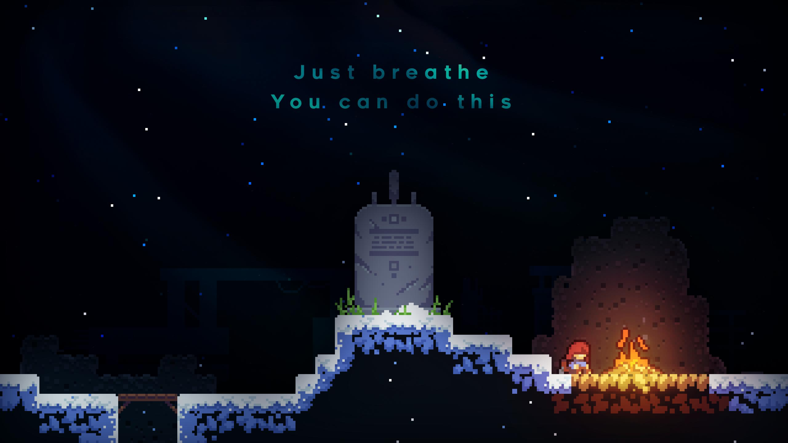
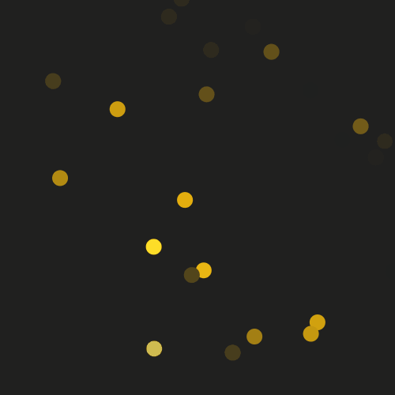
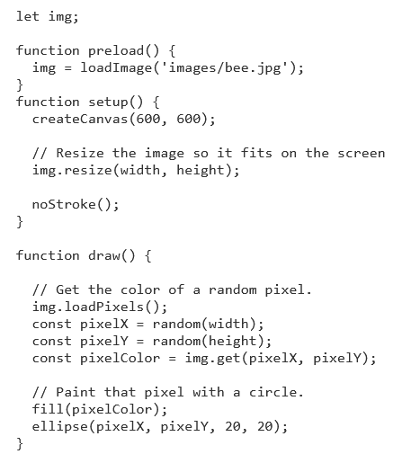
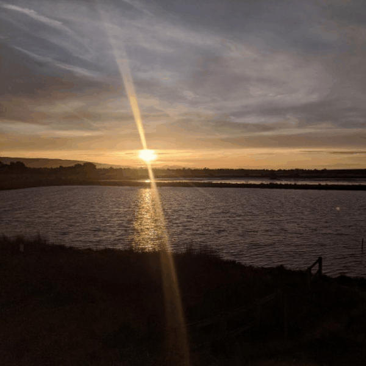
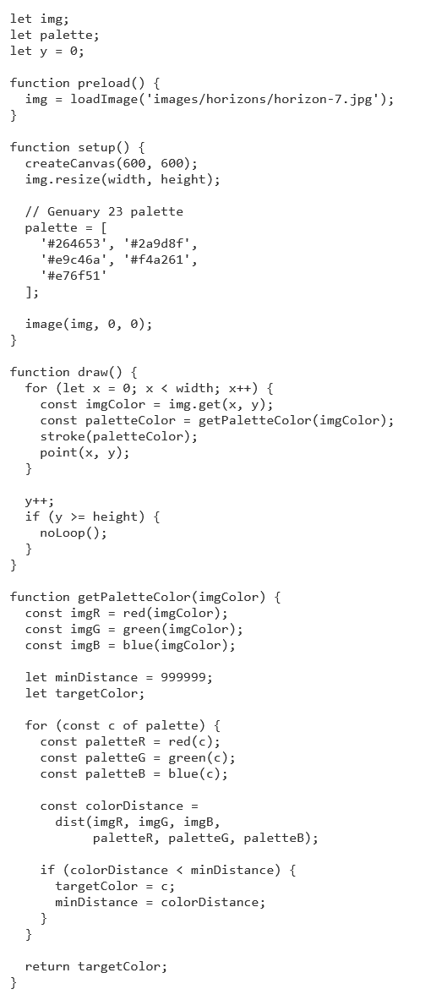

# ylou0466_9103_tut10
# Week 8 Quiz
## Part 1: Imaging Technique Inspiration

My project aims to incorporate Pixel Art as an imaging technique, inspired by the platformer game *Celeste*. This game features exquisitely crafted pixel art, with perfectly balanced color usage and lighting effects that create a visually stunning and layered appearance.

- **Pixel Art Application**: I plan to apply this pixel art style to my project, using an 8-bit style to reinterpret classic paintings. Considering the assignment requirements, pixel art can dynamically depict changes in lighting through alterations in color and gradient transitions.
- **Interactive Backgrounds**: Furthermore, it allows for interactive background adjustments based on user input, enhancing overall interactivity of the visuals.

## Part 2: Coding Technique Exploration

I intend to use **Pixel Painter** to achieve this effect.

- **Pixel Painter**: It converts an image into a digital painting. Every frame, it selects a random pixel from the original image and draws a dot with that pixel’s color, as described.

[Link Text](https://happycoding.io/tutorials/p5js/images/pixel-painter)

  
Additionally, **Image Palette** will be extremely useful.

- **Image Palette**: This sketch modifies the colors in an image to match a selected palette. With this code, I can change the scene's colors to simulate different times of the day, such as transitions from sunrise to sunset or from day to night.

[Link Text](https://happycoding.io/tutorials/p5js/images/image-palette)

